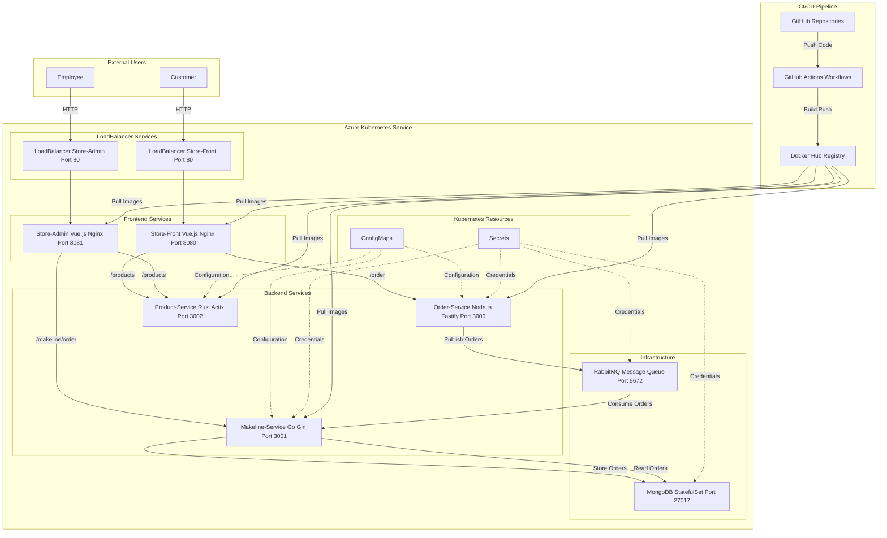

# Architecture Diagram

```mermaid
graph TB
    subgraph "External Users"
        Customer[Customer]
        Employee[Employee]
    end

    subgraph "Azure Kubernetes Service"
        subgraph "LoadBalancer Services"
            LB_Front[LoadBalancer Store-Front Port 80]
            LB_Admin[LoadBalancer Store-Admin Port 80]
        end

        subgraph "Frontend Services"
            StoreFront[Store-Front Vue.js Nginx Port 8080]
            StoreAdmin[Store-Admin Vue.js Nginx Port 8081]
        end

        subgraph "Backend Services"
            OrderService[Order-Service Node.js Fastify Port 3000]
            ProductService[Product-Service Rust Actix Port 3002]
            MakelineService[Makeline-Service Go Gin Port 3001]
        end

        subgraph "Infrastructure"
            RabbitMQ[RabbitMQ Message Queue Port 5672]
            MongoDB[MongoDB StatefulSet Port 27017]
        end

        subgraph "Kubernetes Resources"
            ConfigMaps[ConfigMaps]
            Secrets[Secrets]
        end
    end

    subgraph "CI/CD Pipeline"
        GitHub[GitHub Repositories]
        GitHubActions[GitHub Actions Workflows]
        DockerHub[Docker Hub Registry]
    end

    Customer -->|HTTP| LB_Front
    Employee -->|HTTP| LB_Admin
    LB_Front --> StoreFront
    LB_Admin --> StoreAdmin

    StoreFront -->|/products| ProductService
    StoreFront -->|/order| OrderService
    StoreAdmin -->|/products| ProductService
    StoreAdmin -->|/makeline/order| MakelineService

    OrderService -->|Publish Orders| RabbitMQ
    RabbitMQ -->|Consume Orders| MakelineService
    MakelineService -->|Store Orders| MongoDB
    MakelineService -->|Read Orders| MongoDB

    ConfigMaps -.->|Configuration| OrderService
    ConfigMaps -.->|Configuration| ProductService
    ConfigMaps -.->|Configuration| MakelineService
    Secrets -.->|Credentials| MongoDB
    Secrets -.->|Credentials| RabbitMQ
    Secrets -.->|Credentials| OrderService
    Secrets -.->|Credentials| MakelineService

    GitHub -->|Push Code| GitHubActions
    GitHubActions -->|Build Push| DockerHub
    DockerHub -->|Pull Images| OrderService
    DockerHub -->|Pull Images| ProductService
    DockerHub -->|Pull Images| MakelineService
    DockerHub -->|Pull Images| StoreFront
    DockerHub -->|Pull Images| StoreAdmin
```
