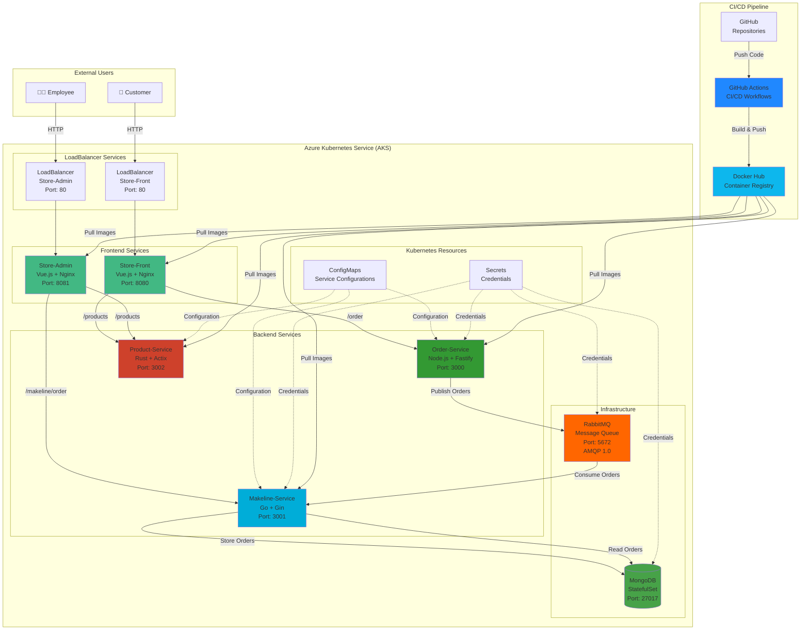

# Architecture Diagram

## Mermaid Diagram (Renders on GitHub)

```mermaid
graph TB
    subgraph "External Users"
        Customer[👤 Customer]
        Employee[👨‍💼 Employee]
    end

    subgraph "Azure Kubernetes Service (AKS)"
        subgraph "LoadBalancer Services"
            LB_Front[LoadBalancer<br/>Store-Front<br/>Port: 80]
            LB_Admin[LoadBalancer<br/>Store-Admin<br/>Port: 80]
        end

        subgraph "Frontend Services"
            StoreFront[Store-Front<br/>Vue.js + Nginx<br/>Port: 8080]
            StoreAdmin[Store-Admin<br/>Vue.js + Nginx<br/>Port: 8081]
        end

        subgraph "Backend Services"
            OrderService[Order-Service<br/>Node.js + Fastify<br/>Port: 3000]
            ProductService[Product-Service<br/>Rust + Actix<br/>Port: 3002]
            MakelineService[Makeline-Service<br/>Go + Gin<br/>Port: 3001]
        end

        subgraph "Infrastructure"
            RabbitMQ[RabbitMQ<br/>Message Queue<br/>Port: 5672<br/>AMQP 1.0]
            MongoDB[(MongoDB<br/>StatefulSet<br/>Port: 27017)]
        end

        subgraph "Kubernetes Resources"
            ConfigMaps[ConfigMaps<br/>Service Configurations]
            Secrets[Secrets<br/>Credentials]
        end
    end

    subgraph "CI/CD Pipeline"
        GitHub[GitHub<br/>Repositories]
        GitHubActions[GitHub Actions<br/>CI/CD Workflows]
        DockerHub[Docker Hub<br/>Container Registry]
    end

    Customer -->|HTTP| LB_Front
    Employee -->|HTTP| LB_Admin
    LB_Front --> StoreFront
    LB_Admin --> StoreAdmin

    StoreFront -->|/products| ProductService
    StoreFront -->|/order| OrderService
    StoreAdmin -->|/products| ProductService
    StoreAdmin -->|/makeline/order| MakelineService

    OrderService -->|Publish Orders| RabbitMQ
    RabbitMQ -->|Consume Orders| MakelineService
    MakelineService -->|Store Orders| MongoDB
    MakelineService -->|Read Orders| MongoDB

    ConfigMaps -.->|Configuration| OrderService
    ConfigMaps -.->|Configuration| ProductService
    ConfigMaps -.->|Configuration| MakelineService
    Secrets -.->|Credentials| MongoDB
    Secrets -.->|Credentials| RabbitMQ
    Secrets -.->|Credentials| OrderService
    Secrets -.->|Credentials| MakelineService

    GitHub -->|Push Code| GitHubActions
    GitHubActions -->|Build & Push| DockerHub
    DockerHub -->|Pull Images| OrderService
    DockerHub -->|Pull Images| ProductService
    DockerHub -->|Pull Images| MakelineService
    DockerHub -->|Pull Images| StoreFront
    DockerHub -->|Pull Images| StoreAdmin

    style StoreFront fill:#42b883
    style StoreAdmin fill:#42b883
    style OrderService fill:#339933
    style ProductService fill:#ce412b
    style MakelineService fill:#00add8
    style RabbitMQ fill:#ff6600
    style MongoDB fill:#47a248
    style GitHubActions fill:#2088ff
    style DockerHub fill:#0db7ed
```
